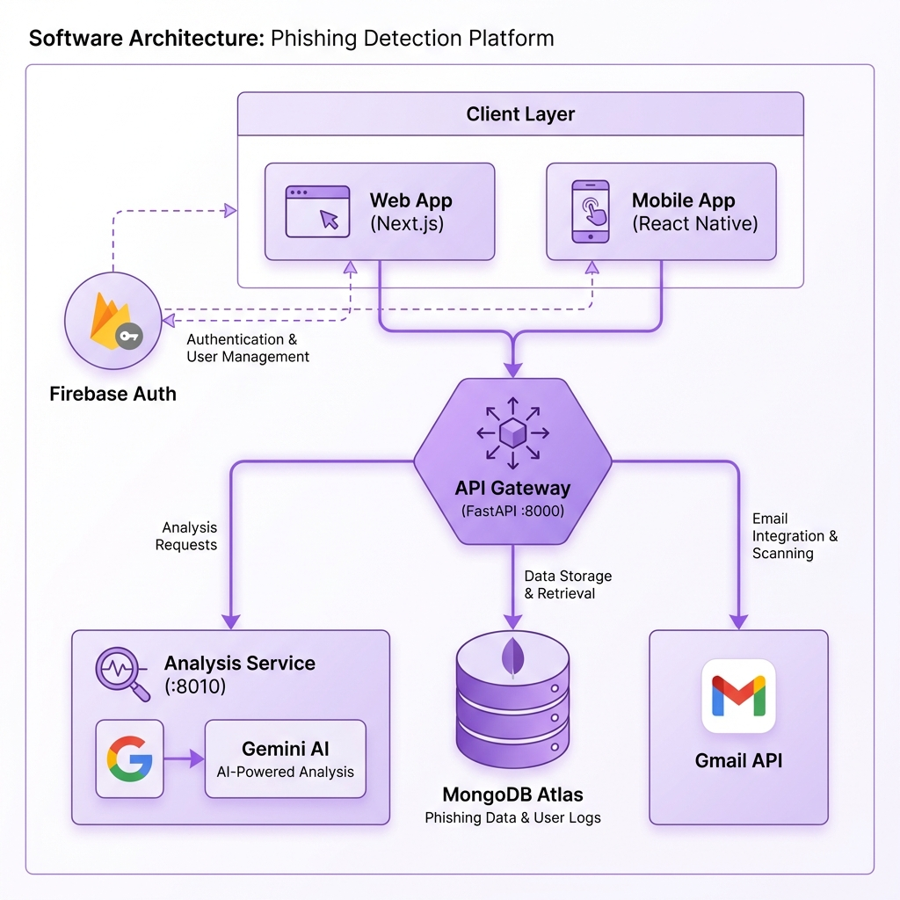
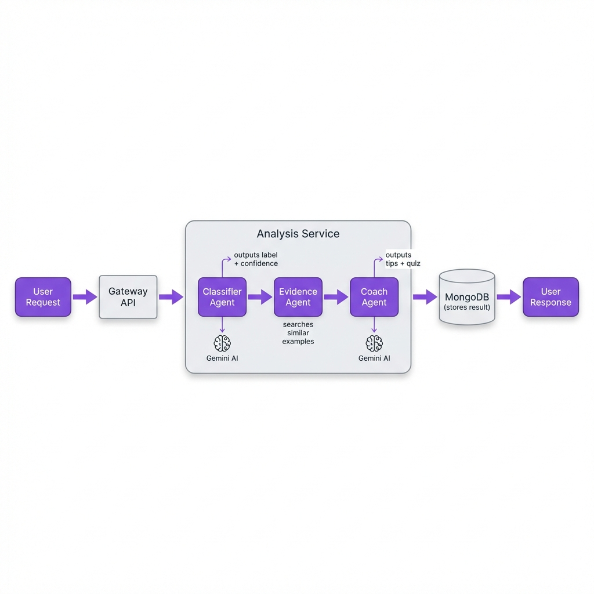
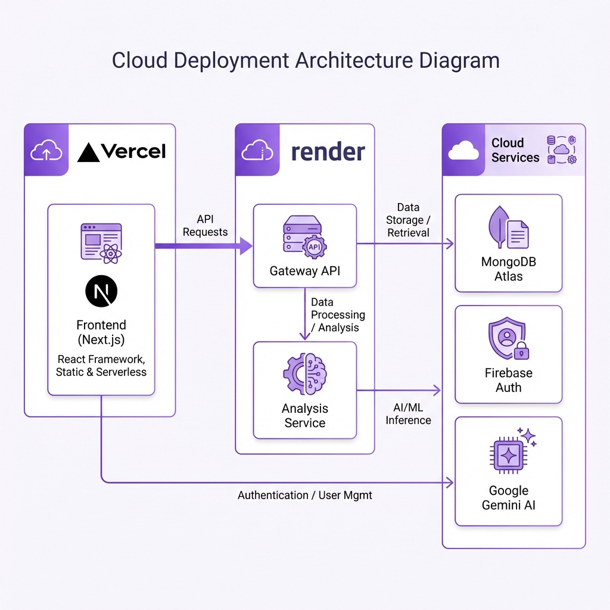

# ThreatIQ Architecture

## System Overview

ThreatIQ is an AI-powered phishing detection platform with gamified security training. The system uses a microservices architecture with multi-agent AI orchestration.



---

## Component Architecture

### Frontend (Next.js 14)
| Module | Purpose |
|--------|---------|
| `app/analyze` | Message analysis interface |
| `app/dashboard` | Stats, charts, Gmail card |
| `app/lessons` | Daily micro-lessons with quizzes |
| `app/history` | Analysis history |
| `app/profile` | User profile and weak spots |
| `components/` | Navbar, GmailIntegration, ProtectedRoute |
| `context/AuthContext` | Firebase auth state management |
| `lib/api.ts` | Axios client with auto-auth |

### Backend / Gateway (FastAPI - Port 8000)
| Module | Purpose |
|--------|---------|
| `routers/analysis.py` | `/api/analyze`, `/api/analyze-public` |
| `routers/gmail.py` | OAuth flow, triage, labeling |
| `routers/lessons.py` | Daily lessons, quiz, XP system |
| `routers/profile.py` | User stats, history |
| `routers/auth.py` | Firebase token verification |
| `services/gmail_*` | OAuth, client, triage services |
| `services/crypto.py` | Fernet encryption for tokens |

### Analysis Service (FastAPI - Port 8010)
**Stateless AI microservice** - no database writes
| Endpoint | Purpose |
|----------|---------|
| `POST /analyze` | Full AI analysis pipeline |
| `GET /health` | Health check |

### Mobile (Expo React Native)
- Dark theme matching web UI
- Firebase email/password auth
- Full API integration
- EAS build for APK

---

## Multi-Agent System

Sequential orchestration of specialized AI agents:



### Agent Responsibilities

| Agent | Input | Output |
|-------|-------|--------|
| **Classifier** | Raw message text | `{label, confidence, reason_tags}` |
| **Evidence** | Message text | `{similar_examples, categories}` |
| **Memory** | User ID | `{profile, learning_context, weak_spots}` |
| **Coach** | Classification + Evidence + Memory | `{explanation, tips, quiz}` |

---

## Data Flow

### Analysis Request Flow
1. Client sends `POST /api/analyze` to Gateway
2. Gateway verifies Firebase token
3. Gateway forwards to Analysis Service
4. Analysis Service runs agent pipeline (Classifier → Evidence → Coach)
5. Gateway stores result in MongoDB
6. Response returned to client

### Gmail Triage Flow
1. User connects Gmail via OAuth
2. Encrypted tokens stored in MongoDB
3. Triage fetches unread emails from Gmail API
4. Each email classified by Analysis Service
5. Labels applied (`ThreatIQ/Safe`, `ThreatIQ/Suspicious`, `ThreatIQ/Phishing`)
6. Results stored and returned

---

## Database Schema (MongoDB)

| Collection | Purpose | Key Fields |
|------------|---------|------------|
| `user_profiles` | Performance tracking | `user_id`, `accuracy`, `weak_spots` |
| `interaction_logs` | Analysis history | `user_id`, `message`, `result`, `timestamp` |
| `gmail_tokens` | Encrypted OAuth tokens | `user_id`, `encrypted_token` |
| `gmail_triage` | Triage history | `user_id`, `results`, `timestamp` |
| `lesson_progress` | XP, streaks, completions | `user_id`, `xp`, `level`, `streak` |

---

## Deployment Architecture



### Deployment URLs
| Service | Platform | Notes |
|---------|----------|-------|
| Frontend | Vercel | Auto-deploy on `main` push |
| Gateway API | Render | Free tier, cold starts |
| Analysis Service | Render | Separate deploy |
| Database | MongoDB Atlas | Free M0 cluster |

### Docker Compose (Local)
```bash
docker-compose up --build
# Gateway: localhost:8000
# Analysis: localhost:8010
```

---

## Security Architecture

### Authentication Flow
1. Client authenticates with Firebase (Google or email/password)
2. Firebase returns ID token
3. Client includes token in `Authorization: Bearer <token>` header
4. Gateway verifies token via Firebase Admin SDK
5. Protected request processed

### OAuth Token Security (Gmail)
1. **Server-side exchange**: Frontend never sees OAuth tokens
2. **Fernet encryption**: Tokens encrypted at rest (AES-128-CBC + HMAC)
3. **State parameter**: CSRF protection on OAuth flow
4. **CORS**: Restricted to allowed origins

### Security Measures
| Layer | Protection |
|-------|------------|
| Transport | HTTPS everywhere |
| Auth | Firebase ID tokens on all protected endpoints |
| Storage | Encrypted tokens, MongoDB TLS |
| API | Rate limiting, CORS, input validation |

---

## Tech Stack Summary

| Layer | Technology |
|-------|------------|
| **Frontend** | Next.js 14, TypeScript, TailwindCSS, ShadCN UI, Recharts |
| **Backend** | FastAPI, Python 3.11, Pydantic |
| **AI/ML** | Google Gemini API, scikit-learn (TF-IDF) |
| **Auth** | Firebase Authentication |
| **Database** | MongoDB Atlas (Motor async driver) |
| **Mobile** | Expo, React Native, expo-router |
| **DevOps** | Docker, GitHub Actions CI, Vercel, Render |
